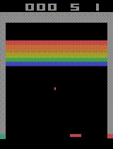
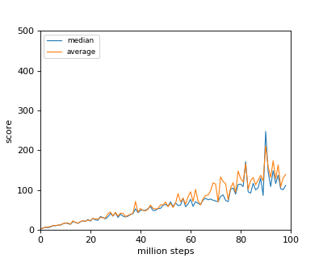
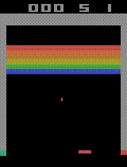
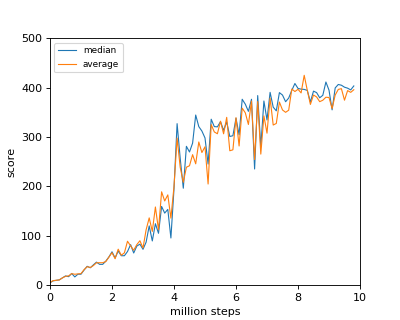
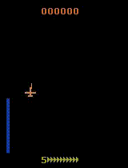
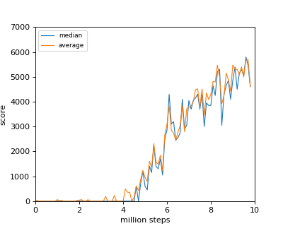
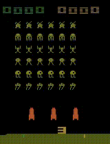
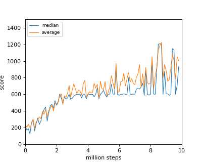

# chainer-ppo
Reproduction codes of Proximal Policy Optimization (PPO) with chainer

# About

This  repo is a PPO reproduction codes writen with chainer. [See this original paper](https://arxiv.org/abs/1707.06347) for details

# Training the network

Choose the params and run below command.
The default parameters are set for running in atari environment. 

Example:

```sh
python3 main.py --env-type='atari' 
```
For the detail of the parameters check the code or type 

```sh
python3 main.py --help
```

# Results
## Atari

### Breakout
#### Small model (2 conv layers model)

```sh
$ python3 main.py --env-type='atari' --test-run --model-params=trained_results/atari/breakout/small/final_model --atari-model-size='small'
```

|result|score|
|:---:|:---:|
|  ||


#### Large model (3 conv layers model)

```sh
python3 main.py --env-type='atari' --test-run --model-params=trained_results/atari/breakout/large/final_model --atari-model-size='large'
```

|result|score|
|:---:|:---:|
|  ||

### Zaxxon

#### Large model (3 conv layers model)

```sh
python3 main.py --env-type='atari' --test-run --model-params=trained_results/atari/zaxxon/large/final_model --atari-model-size='large' --env='ZaxxonNoFrameskip-v4'
```

|result|score|
|:---:|:---:|
|  ||

### Space Invaders

#### Large model (3 conv layers model)

```sh
python3 main.py --env-type='atari' --test-run --model-params=trained_results/atari/space_invaders/large/final_model --atari-model-size='large' --env='SpaceInvadersNoFrameskip-v4'
```

|result|score|
|:---:|:---:|
|  ||


## Mujoco
Sorry in progress...